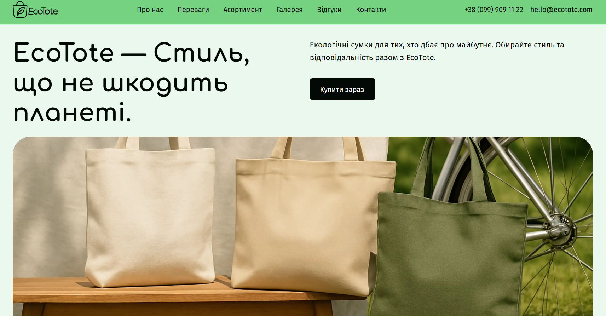

# 👜 Eco-Tote — Стиль, що не шкодить планеті

<p align="center">
  
</p>

---

## 🎯 Про проєкт

📄 **Live Page:**
[Переглянути проєкт](https://yevhenii-priadko.github.io/it-creators-13-project-eco-tote/)

**Eco-Tote** — це сайт, орієнтований на екологічну свідомість і популяризацію сталого способу життя через використання еко-сумок. Платформа допомагає знайти екологічні альтернативи, заохочує робити усвідомлений вибір не лише за зовнішнім виглядом, а й за користю, демонструє приклади використання у повсякденному житті та надихає на перші кроки до екологічних змін — наприклад, придбати власну еко-сумку.

---

## 🛠 Використані технології

[](https://skillicons.dev)

| Компонент      | Технологія                               |
| :------------- | :--------------------------------------- |
| **Стилізація** | SCSS (BEM Methodology), CSS3 Transitions |
| **Логіка**     | JavaScript                               |

---

## 📐 Адаптивність та Оптимізація

Проєкт пройшов повний цикл тестування на відповідність макету:

📱 _Mobile First:_ Гумова верстка від 375px.

📟 _Tablet:_ Адаптив від 768px (спеціальне позиціонування бургер-меню).

💻 _Desktop:_ Повнорозмірна версія 1440px.

---

## 👥 Наша Команда

|                                  Аватар                                   | Розробник                                              | Роль             | Секція та технічний внесок                                                                                                      |
| :-----------------------------------------------------------------------: | :----------------------------------------------------- | :--------------- | :------------------------------------------------------------------------------------------------------------------------------   |
|  | [Yevhenii Priadko](https://github.com/Evgeniy-sub8way) | **Team Lead**    | **Header Section:** Архітектура проєкту, налаштування збірки Vite, розробка хедеру та координація технічних рішень.     |
|    | [Olha Borzynska](https://github.com/OlyaBorzynska)     | **Scrum Master** | **Hero Section:** Розробка блоку "Герой", модерація документації (README), контроль термінів та внутрішня комунікація.                  |
|    | [Ivan Shkilnyi](https://github.com/Ivan-Shkilnyi)      | Developer     | **Feedback Section:** Розробка блоку "Відгуки клієнтів".     |
|         | [Liliia Pastushenko](https://github.com/Liliia-2)      | Developer    | **Gallery Section:** Розробка блоку "Галерея".   |
|     | [Oleksii](https://github.com/alex-asriian)             | Developer      | **Support Section:** Розробка блоку "Форма підтримки".             |
|    | [SerhiiSergetty](https://github.com/SerhiiSergetty)       | Developer     | **Advantages Section:** Розробка блоку "Переваги наших сумок".      |
|    | [Serhii Serdiuk](https://github.com/SerdiukSerhii)     | Developer     | **Assortment Section:** Розробка блоку "Асортимент" та функціонал кнопки бургер-меню. |
|      | [Viktoria Alexandrova](https://github.com/Vika0605-av) | Developer      | **Footer Section:** Розробка підвалу сайту, інтеграція соціальних мереж.  |
|       | [Yuliia Kozak](https://github.com/YuliaKozak)          | Developer      | **About:** Розробка блоку "Про еко-сумки".              |

---

## 🏗️ Структура проєкту

**Код організований модульно для зручності підтримки:**

🔹 src/partials/ — HTML-фрагменти (компоненти сторінки).

🔹 src/css/ — стилі компонентів (SCSS).

🔹 src/js/ — JS-файли для функціоналу кнопки бургер-меню.

🔹 public/ — статичні ресурси.

---

## 💡 Супутня інформація

- **UI Kit:** Використано кастомні рішення для рейтингів та інтерактивних кнопок
  згідно з макетом у Figma.
- **Деплой:** Автоматизовано через GitHub Actions / Pages.

---

## ⚙️ Як запустити проєкт локально

**Клонувати репозиторій:**

```bash
git clone https://github.com/yevhenii-priadko/it-creators-13-project-eco-tote.git
```

**Встановити залежності:**

```bash
npm install
```

**Запустити режим розробки:**

```bash
npm run dev
```
